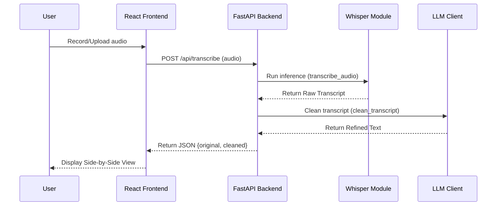
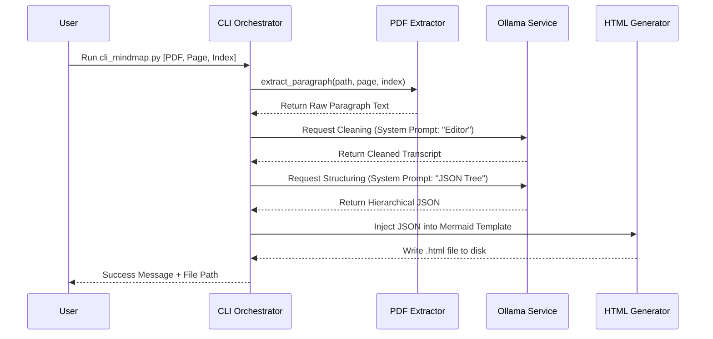
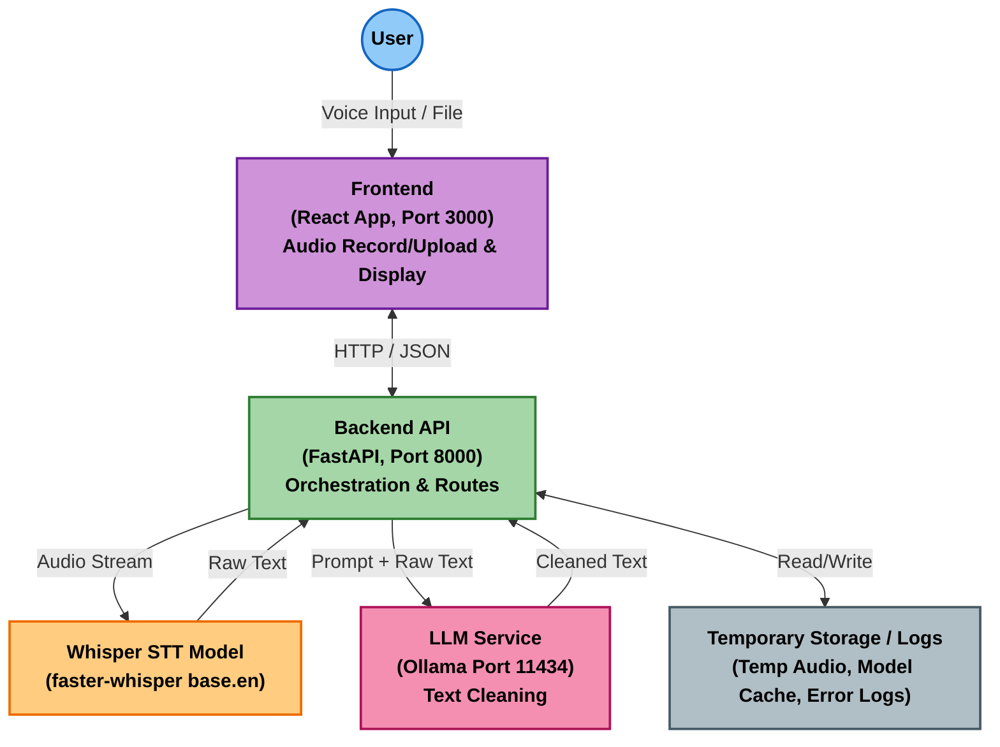
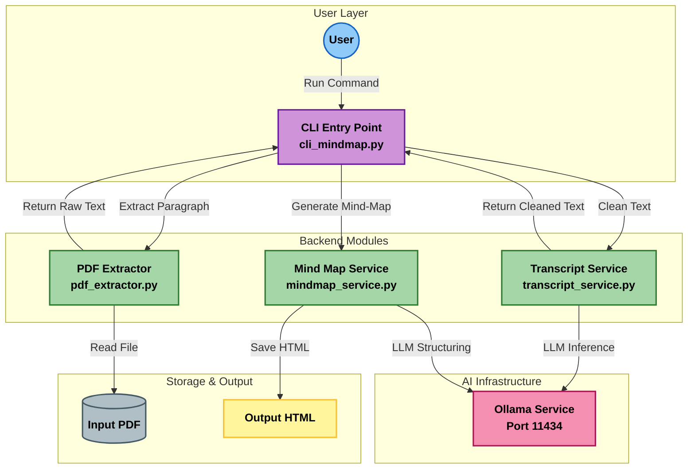
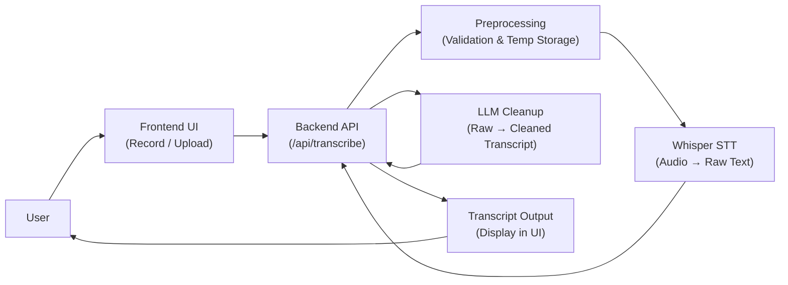
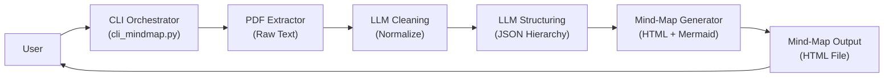

# 1. Local AI Transcript & Mind-Map App — High level Architecture Overview

The Local AI Transcript & Mind-Map App is a full-stack application designed to transform unstructured information (audio or text) into structured, meaningful output — entirely offline. The system now supports two primary processing pipelines:

- **Voice → Transcript Pipeline:**  
  Users record or upload audio through the browser. The backend processes the audio using Whisper to generate a raw transcript, which is then cleaned and refined using a locally running LLM (ollama).

- **PDF Paragraph → Mind-Map Pipeline (New Feature):**  
  The system extracts a user-specified paragraph from a PDF, normalizes and cleans the text, then generates both a JSON-based hierarchical mind-map and a visual mind-map representation using LLM-driven semantic structuring.

The entire application runs locally using three coordinated services:

- **Frontend:** React UI on port **3000** for audio recording and transcript display
- **Backend:** FastAPI server on port **8000** responsible for orchestration, processing, and the new mind-map command/API
- **AI Service:** Ollama LLM runtime on port **11434**, providing text refinement and mind-map generation

> **Privacy & Offline Support:**  
> All inference — Whisper transcription and LLM reasoning — is performed locally on the CPU. No cloud APIs, online model calls, or external dependencies are required in the default setup.

# 2. Core Components

### 2. Core Components

|   #    | Component                                    | Location                      | Responsibility                                                                                                                                  | Key Functions / Behavior                                                                                                                                               |
| :----: | :------------------------------------------- | :---------------------------- | :---------------------------------------------------------------------------------------------------------------------------------------------- | :--------------------------------------------------------------------------------------------------------------------------------------------------------------------- |
| **1**  | **Frontend**<br>_(React App)_                | `/frontend`                   | <ul><li>Provides UI for recording or uploading audio</li><li>Sends requests to backend</li><li>Displays raw + cleaned transcript</li></ul>      | <ul><li>`AudioRecorder`: Handles microphone stream</li><li>`UploadHandler`: Manages file processing</li><li>`useTranscription`: Custom hook for API calls</li></ul>    |
| **2**  | **Backend API**<br>_(FastAPI)_               | `/backend/app.py`             | <ul><li>Main orchestration layer for the web app</li><li>Triggers transcription and LLM cleanup</li><li>Returns structured JSON to UI</li></ul> | <ul><li>`POST /api/transcribe`: Orchestrates audio processing</li><li>`POST /api/clean`: Triggers LLM refinement</li><li>Middleware: Handles CORS and errors</li></ul> |
| **3**  | **Transcription Module**<br>_(Whisper)_      | `/backend/transcription.py`   | <ul><li>Converts audio into raw text using `faster-whisper`</li><li>Optimized for local CPU execution</li></ul>                                 | <ul><li>`transcribe_audio()`: Loads model, processes audio buffer, returns text segments</li></ul>                                                                     |
| **4**  | **LLM Processing Module**<br>_(Cleaner)_     | `/backend/llm_client.py`      | <ul><li>Cleans or enhances the raw transcript</li><li>Removes filler words and fixes grammar</li></ul>                                          | <ul><li>`clean_transcript()`: Sends prompt to local LLM</li><li>Uses system prompt to enforce "editor" role</li></ul>                                                  |
| **5**  | **Configuration Manager**                    | `.env`<br>`.env.example`      | <ul><li>Stores application settings (models, ports, keys)</li><li>Controls runtime environment</li></ul>                                        | <ul><li>`os.getenv()`: Loads `LLM_MODEL`, `WHISPER_MODEL`</li><li>Toggles between different LLM backends (Ollama/OpenAI)</li></ul>                                     |
| **6**  | **Logging & Error Handler**                  | Backend Logic                 | <ul><li>Tracks errors and execution metrics</li><li>Debugs pipeline failures</li></ul>                                                          | <ul><li>Records execution time (`start` vs `end`)</li><li>Logs token counts and object sizes</li><li>Catches and reports `500` errors</li></ul>                        |
| **7**  | **Model Runtime**<br>_(Ollama)_              | External Service<br>`:11434`  | <ul><li>Hosts the large language models</li><li>Provides inference API</li></ul>                                                                | <ul><li>`POST /v1/chat/completions`: Standard endpoint for text generation</li><li>Manages model loading/unloading from RAM</li></ul>                                  |
| **8**  | **PDF Extraction Module**<br>_(New Feature)_ | `/backend/pdf_extractor.py`   | <ul><li>Parses PDF documents to isolate text</li><li>Implements paragraph extraction logic</li></ul>                                            | <ul><li>`extract_paragraph(path, page, index)`: logic to locate and return specific text blocks</li><li>Handles different newline formats</li></ul>                    |
| **9**  | **Mind Map Service**<br>_(New Feature)_      | `/backend/mindmap_service.py` | <ul><li>Analyzes text structure</li><li>Generates visualization files</li></ul>                                                                 | <ul><li>`generate_mindmap_json()`: Prompts LLM for recursive JSON</li><li>`save_mindmap_html()`: Injects JSON into Mermaid.js template</li></ul>                       |
| **10** | **CLI Orchestrator**<br>_(New Feature)_      | `/backend/cli_mindmap.py`     | <ul><li>Entry point for Mind Map generation</li><li>Chains the pipeline together</li></ul>                                                      | <ul><li>`main()`: Runs Extraction → Cleaning → Mapping sequence</li><li>Provides command-line arguments and status logging</li></ul>                                   |

## 3. Component Interactions (Data & Control Flow)

This system now operates using two distinct interaction pipelines:

1. the **Web App Pipeline** for voice-to-text transcription, and
2. the **CLI Tool Pipeline** for PDF-to-mind-map generation.

---

### A. Web App — Audio Transcription Flow (Original System)

This flow handles the user-facing voice-to-transcript workflow.



#### **A. Web App: Audio Transcription Workflow**

This workflow describes how recorded or uploaded audio is converted into readable text.

| Step | Action                                                   | Component Responsible       |
| ---- | -------------------------------------------------------- | --------------------------- |
| 1    | User records or uploads audio                            | Frontend (Browser UI)       |
| 2    | Audio is sent as a request to `/api/transcribe`          | Frontend → Backend          |
| 3    | Audio format is validated and temporarily stored         | Backend                     |
| 4    | Whisper model performs speech-to-text conversion         | Transcription Module        |
| 5    | Raw transcript is sent to LLM for refinement             | Backend → Local LLM Service |
| 6    | Cleaned transcript is returned to the backend            | LLM Service                 |
| 7    | Backend returns JSON response `{raw_text, cleaned_text}` | Backend                     |
| 8    | Transcript is displayed (side-by-side) to the user       | Frontend UI                 |

**Result:**  
User receives both raw and refined text for comparison and further usage.

---

### B. CLI Tool — PDF-to-Mind-Map Flow (New Feature)



#### **B. CLI Tool: PDF-to-Mind-Map Workflow (New Feature)**

This workflow explains how a paragraph in a PDF becomes a structured mind-map.

| Step | Action                                                                 | Component Responsible |
| ---- | ---------------------------------------------------------------------- | --------------------- |
| 1    | User runs CLI command with PDF path, page, and paragraph index         | User → CLI Tool       |
| 2    | Text is extracted from selected paragraph                              | PDF Extractor Module  |
| 3    | Extracted text is cleaned using the LLM (normalization and grammar)    | CLI → LLM Service     |
| 4    | Cleaned text is sent back to LLM to generate structured JSON hierarchy | CLI → LLM Service     |
| 5    | JSON is embedded into an HTML/Mermaid mind-map template                | Mind-Map Generator    |
| 6    | Final mind-map `.html` file is saved to disk                           | CLI Tool              |
| 7    | CLI prints the `"Success"` message with output file location           | CLI Output            |

**Result:**  
User obtains an interactive web-based mind map derived from the selected paragraph.

---

## 4. Deployment Architecture

### 4.1 Overall Setup

The application is designed as a modular, local-first architecture consisting of three primary runtime components:

| Component            | Description                                                                   | Default Address                                                         |
| -------------------- | ----------------------------------------------------------------------------- | ----------------------------------------------------------------------- |
| **Frontend Service** | React (Vite) UI for recording and viewing results                             | `http://localhost:3000`                                                 |
| **Backend Service**  | FastAPI server providing APIs and the CLI entry point for mind-map generation | `http://localhost:8000`                                                 |
| **AI Service**       | Local LLM runtime (Ollama), exposing an OpenAI-compatible API                 | `http://ollama:11434` (Devcontainer) or `http://localhost:11434` (Host) |

All components run entirely **locally**—either directly on the host machine or inside a Dev Container—ensuring privacy and eliminating cloud dependencies.

---

### 4.2 Dependencies

#### **System & Runtime Requirements**

- **Node.js 20+** (Frontend)
- **Python 3.12+** (Backend)
- **Ollama runtime** with required AI models

#### **Required Models**

| Category | Model                        | Notes                                              |
| -------- | ---------------------------- | -------------------------------------------------- |
| LLM      | `gemma3:4b` or `llama3.1:8b` | Used for transcript cleaning + mind-map generation |
| ASR      | Faster-Whisper model weights | Auto-downloaded on first inference                 |

#### **Backend Python Dependencies** (managed via `uv` or `pip`):

- `fastapi` / `uvicorn` → Backend server
- `faster-whisper` → Local speech-to-text inference
- `openai` → SDK for interacting with Ollama
- `pypdf` → **(New Feature)** PDF paragraph extraction
- `python-dotenv` → Loads `.env` configuration

#### **Frontend JavaScript Dependencies** (managed via `npm`):

- `react` / `react-dom`
- `typescript`
- `vite`
- `lucide-react` (icons)

#### **Visualization Dependencies**

- **Mermaid.js** — loaded via CDN for rendering generated mind-maps

---

### 4.3 Environment Configuration

Runtime behavior is controlled through environment variables stored in:

Because the project runs in a Dev Container, the backend must reference the **Docker service hostname** (`ollama`) instead of `localhost`.

```env
# --- AI Service Configuration ---
LLM_BASE_URL=http://ollama:11434/v1
LLM_API_KEY=ollama   # Required by SDK, ignored by Ollama

# Local LLM model (must be available in `ollama list`)
LLM_MODEL=gemma3:4b

# --- Whisper Configuration ---
# Recommended for CPU inference
WHISPER_MODEL=base.en
```

---

## 5. Runtime Behavior

---

### 5.1 Initialization

#### **Backend Service (FastAPI)**

- **App Startup:** FastAPI initializes and registers available API routes.
- **Config Load:** Environment variables (`LLM_BASE_URL`, `WHISPER_MODEL`, etc.) are loaded via `python-dotenv`.
- **Model Loading:** The Whisper model (`faster-whisper`) is **lazy-loaded** on the first transcription request or eagerly at startup depending on configuration.
- **Logging:** A custom logger tracks execution time, memory usage, and request lifecycle events.

#### **CLI Tool (Mind Map Generator)**

- **Entry:** The script `cli_mindmap.py` is invoked with arguments such as:  
  `uv run python cli_mindmap.py file.pdf 1 3`
- **Environment:** Loads `.env` immediately to determine LLM host and model.
- **Validation:** Verifies the existence and accessibility of the input PDF before processing.

---

### 5.2 Typical Workflows

#### **A. Web Workflow (Capture → Transcribe → Clean → Output)**

| Phase             | Action                                                          |
| ----------------- | --------------------------------------------------------------- |
| **Input**         | User records audio or uploads a file through the React UI       |
| **Request**       | Frontend sends a POST request to `/api/transcribe`              |
| **Transcription** | Whisper processes the audio and generates a raw transcript      |
| **Cleaning**      | Raw transcript is refined using the local LLM (Ollama)          |
| **Output**        | Backend returns JSON: `{ "original": "...", "cleaned": "..." }` |

#### **B. CLI Workflow (Extract → Clean → Structure → Visualize)**

| Phase             | Action                                                                                   |
| ----------------- | ---------------------------------------------------------------------------------------- |
| **Extraction**    | `pdf_extractor.py` locates page and paragraph using heuristics (`\n\n` fallback to `\n`) |
| **Cleaning**      | Extracted text is normalized using the same LLM logic as the web flow                    |
| **Structuring**   | Cleaned text is sent to LLM with a controlled prompt to produce strict JSON hierarchy    |
| **Visualization** | JSON is transformed into Mermaid.js and written to an HTML file                          |
| **Output**        | Final mind-map HTML file is saved locally and success message is printed                 |

---

### 5.3 Error Handling

| Area                      | Behavior                                                                                                                                                                        |
| ------------------------- | ------------------------------------------------------------------------------------------------------------------------------------------------------------------------------- |
| **PDF Extraction Errors** | - Raises `ValueError` if paragraph index is invalid<br>- Raises `FileNotFoundError` if file is missing or unreadable                                                            |
| **LLM Failures (Ollama)** | - Logs “Connection Refused” if service is offline<br>- Attempts fallback: return raw transcript if cleanup fails<br>- `JSONDecodeError` triggers safe fallback node in mind-map |
| **Transcription Errors**  | Corrupt or unsupported audio files result in `400 Bad Request` with detailed log entry                                                                                          |

---

### 5.4 Resource Usage & Performance

| Resource            | Details                                                                                                                      |
| ------------------- | ---------------------------------------------------------------------------------------------------------------------------- |
| **CPU / GPU**       | Whisper and LLM inference are CPU-intensive (GPU optional)                                                                   |
| **Runtime Pattern** | CLI executes extracting → cleaning → structuring sequentially, causing temporary CPU spikes (10–40s depending on model size) |
| **Memory (RAM)**    | - Baseline system: ~1GB<br>- `gemma3:4b`: 3–4GB<br>- Whisper: 200–500MB<br>- **Recommended Minimum:** 6–8GB total            |
| **Disk Space**      | - LLM weights: ~4GB<br>- Whisper weights: ~200MB<br>- Generated artifacts (HTML): <10KB each                                 |

---

### 5.5 Assumptions

- **PDF Formatting:** Text is assumed to follow standard paragraph separation using newlines. Complex layouts (columns/tables) may require additional parsing logic.
- **Language:** System is currently tuned for English text.
- **Model Availability:** The configured LLM (e.g., `gemma3:4b` or `llama3.1`) must already exist in the local Ollama model store.

## 6. Assumptions

While analyzing the repository and extending the application, the following assumptions were made:

---

### **Whisper Model Variant**

- The system uses a Whisper model defined via environment variable (e.g., `WHISPER_MODEL=base.en`).
- Audio processing is designed for **batch transcription**, not real-time streaming.

---

### **Local LLM Availability**

- The application requires a locally running LLM service (Ollama) that provides an OpenAI-compatible API.
- The configured model (e.g., `gemma3:4b`) must be installed and able to:
  - clean transcript text
  - generate structured JSON output for mind-map creation.

---

### **Audio Format Expectations**

- Supported input formats include `.wav`, `.mp3`, and `.m4a`.
- The browser’s `MediaRecorder` API produces compatible audio blobs without additional conversion.

---

### **Runtime Environment**

- The environment must support loading both Whisper (~500MB) and the LLM model (~4GB) into memory.
- GPU acceleration is optional but significantly improves inference speed.

---

### **Network & Service Availability**

- The backend assumes the LLM service is reachable at:
  - `http://ollama:11434` (container), or
  - `http://localhost:11434` (host machine).
- Mind-map HTML output expects access to the Mermaid.js CDN:

# 7. Diagrams

### 7.1 High-Level Architecture (Web App)



### B.Paragraph -> Mind-map



## 7.2 Data Flow Diagram (Level-0)

### Voice -> transcript



### Paragraph → Mind-Map



## 8. Deep Dive: Mind Map Generation Logic

### 8.1 Mapping Transcripts to Structure

The transformation from linear text (transcript) to hierarchical mind map (JSON) relies on a **semantic extraction pipeline** rather than simple keyword matching.

- **Topic Extraction Algorithm:**

  - The system utilizes the **LLM (Gemma/Llama)** as a zero-shot inference engine.
  - **Rule:** The system prompt enforces a strict schema: `{"root": string, "children": Array<Node>}`.
  - **Heuristics:** The LLM is instructed to identify the "Central Thesis" as the root node and "Supporting Arguments" as child nodes. It uses the semantic weight of sentences (e.g., "First...", "However...", "In conclusion...") to determine hierarchy depth.

- **Parsing Logic:**
  - **Raw Output:** The LLM often wraps JSON in Markdown code blocks (```json).
  - **Sanitization:** A regex post-processor strips these artifacts before parsing.
  - **Validation:** The standard Python `json` library validates the structure. If the LLM produces malformed JSON (a common hallucination in smaller models), the system catches the `JSONDecodeError` and returns a fallback error node to prevent a crash.

### 8.2 Performance Notes & Limitations

- **Sensitivity to Transcript Quality:**

  - **High Sensitivity:** The quality of the mind map is directly proportional to the clarity of the input text. Disjointed or conversational transcripts with many filler words ("um", "like") often result in flat hierarchies (Root → List) because the model cannot discern the structure.
  - **Recommendation:** Always run the "Cleaning" step before the "Structuring" step to maximize hierarchy depth.

- **Maximum Transcript Length:**

  - **Constraint:** The input is limited by the LLM's **context window** (approx. 4096 - 8192 tokens for Llama 3/Gemma).
  - **Behavior:** Passing a PDF paragraph longer than ~2,000 words may result in the middle content being ignored ("lost in the middle" phenomenon) or the JSON output being truncated, causing parse errors.

- **Time & Space Complexity:**
  - **Time:** $O(N)$ relative to input token count. Processing typically takes **0.05s per token** on CPU.
  - **Space:** The JSON structure grows linearly with the number of extracted topics. Memory overhead for the text object is negligible (<1MB), but model weights require constant ~4GB VRAM/RAM.

### 8.3 Logging Strategy Details

To improve code reliability and tracking, the system implements a robust logging strategy:

- **Metadata:** Every operation logs the Source PDF, Page Number, and Paragraph Index to trace artifacts back to their origin.
- **Object Data Tracking:**
  - **Input vs. Output:** We log the `len(text)` before and after cleaning to monitor if the model is hallucinating (adding too much text) or over-pruning (deleting too much).
- **Performance Metrics:**
  - **Execution Time:** `time.time()` deltas are logged for every LLM network call to differentiate between "Network Latency" and "Local Processing".
  - **Memory Usage:** `sys.getsizeof()` is logged for the final text payload to ensure we stay within safe memory bounds for the JSON parser.


