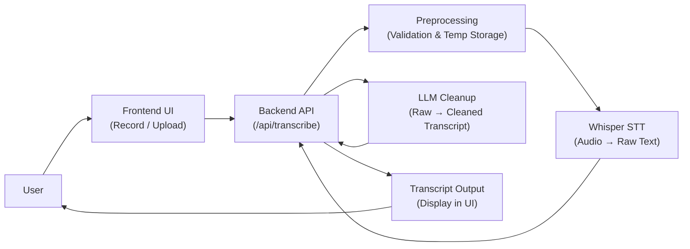
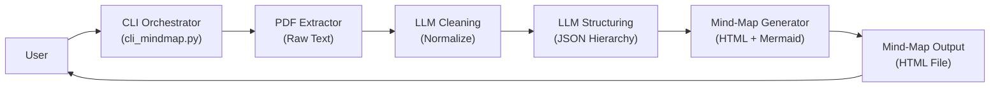

## Voice -> transcript

```mermaid
flowchart LR
    User["User"]
    UI["Frontend UI<br/>(Record / Upload)"]
    API["Backend API<br/>(/api/transcribe)"]
    Pre["Preprocessing<br/>(Validation & Temp Storage)"]
    STT["Whisper STT<br/>(Audio → Raw Text)"]
    Clean["LLM Cleanup<br/>(Raw → Cleaned Transcript)"]
    Out["Transcript Output<br/>(Display in UI)"]

    User --> UI
    UI --> API
    API --> Pre
    Pre --> STT
    STT --> API
    API --> Clean
    Clean --> API
    API --> Out
    Out --> User


```
---

## Paragraph → Mind-Map

```mermaid
flowchart LR
    User["User"]
    CLI["CLI Orchestrator<br/>(cli_mindmap.py)"]
    Extract["PDF Extractor<br/>(Raw Text)"]
    Clean["LLM Cleaning<br/>(Normalize)"]
    Structure["LLM Structuring<br/>(JSON Hierarchy)"]
    Visual["Mind-Map Generator<br/>(HTML + Mermaid)"]
    Out["Mind-Map Output<br/>(HTML File)"]

    User --> CLI
    CLI --> Extract
    Extract --> Clean
    Clean --> Structure
    Structure --> Visual
    Visual --> Out
    Out --> User
```
