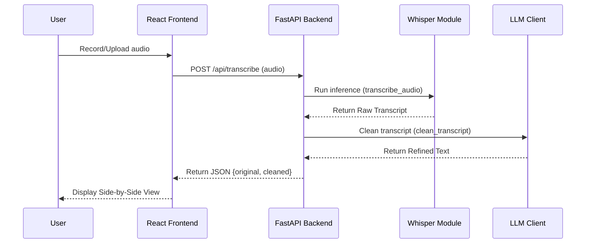
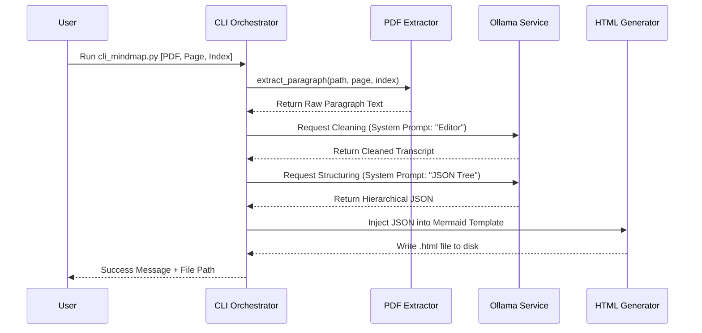

### A. Web App — Audio Transcription Flow (Original System)

This flow handles the user-facing voice-to-transcript workflow.

#### **A. Web App: Audio Transcription Workflow**

This workflow describes how recorded or uploaded audio is converted into readable text.

| Step | Action                                                   | Component Responsible       |
| ---- | -------------------------------------------------------- | --------------------------- |
| 1    | User records or uploads audio                            | Frontend (Browser UI)       |
| 2    | Audio is sent as a request to `/api/transcribe`          | Frontend → Backend          |
| 3    | Audio format is validated and temporarily stored         | Backend                     |
| 4    | Whisper model performs speech-to-text conversion         | Transcription Module        |
| 5    | Raw transcript is sent to LLM for refinement             | Backend → Local LLM Service |
| 6    | Cleaned transcript is returned to the backend            | LLM Service                 |
| 7    | Backend returns JSON response `{raw_text, cleaned_text}` | Backend                     |
| 8    | Transcript is displayed (side-by-side) to the user       | Frontend UI                 |

**Result:**  
User receives both raw and refined text for comparison and further usage.

---

### B. CLI Tool — PDF-to-Mind-Map Flow (New Feature)

#### **B. CLI Tool: PDF-to-Mind-Map Workflow (New Feature)**

This workflow explains how a paragraph in a PDF becomes a structured mind-map.

| Step | Action                                                                 | Component Responsible |
| ---- | ---------------------------------------------------------------------- | --------------------- |
| 1    | User runs CLI command with PDF path, page, and paragraph index         | User → CLI Tool       |
| 2    | Text is extracted from selected paragraph                              | PDF Extractor Module  |
| 3    | Extracted text is cleaned using the LLM (normalization and grammar)    | CLI → LLM Service     |
| 4    | Cleaned text is sent back to LLM to generate structured JSON hierarchy | CLI → LLM Service     |
| 5    | JSON is embedded into an HTML/Mermaid mind-map template                | Mind-Map Generator    |
| 6    | Final mind-map `.html` file is saved to disk                           | CLI Tool              |
| 7    | CLI prints the `"Success"` message with output file location           | CLI Output            |

**Result:**  
User obtains an interactive web-based mind map derived from the selected paragraph.

---
---
